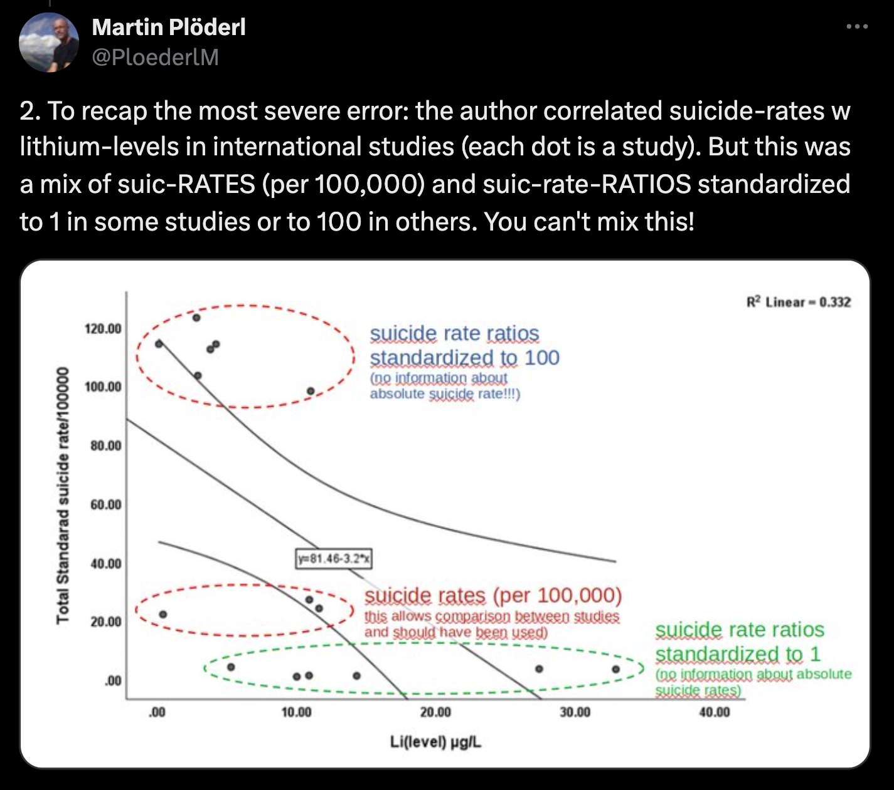
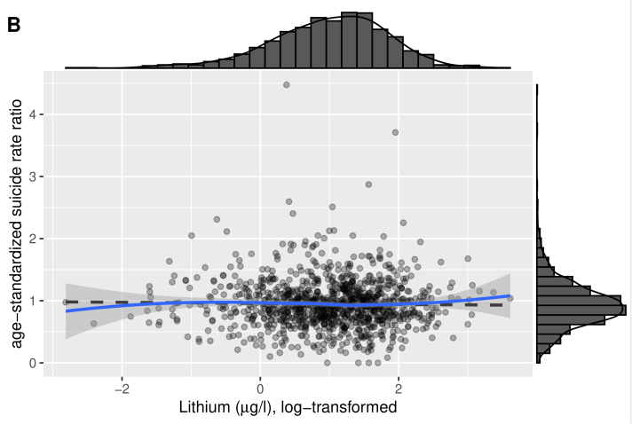
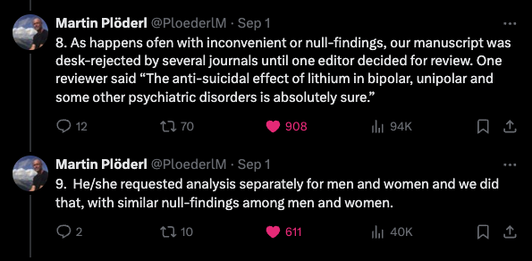

[Fadaei (2023)](https://doi.org/10.1097/YIC.0000000000000432) provided a meta-analysis of the association between death by suicide and the amount of lithium levels in potable water in a given area. The association between lithium levels and suicide has been raised many times over the years in the suicide literature, with some even suggesting that lithium should be added to our drinking water to prevent suicide. 

However, [Plöderl & Naudet (2023)](https://doi.org/10.1097/YIC.0000000000000484) raised multiple serious issues with Fadaei's (2023) analysis. One of the most important issues raised is that Fadaei (2023) inappropriately combined three completely different outcome metrics (suicide ratios, suicide ratios, and another type of suicide ratios) in a single analysis; and that only one of these three metrics is appropriate to the research questions (i.e., suicide rates).

On [Twitter](https://x.com/PloederlM/status/1794990015925178516), Plöderl provided the following annotated plot explaining the issue here:

```{r, out.width='80%'}



```

This RMarkdown document provides additional context for Plöderl & Naudet critique. 

I started by taking the above plot Plöderl posted on twitter. I extracted the plot's data points using [WebPlotDigitizer](https://automeris.io/), an open source tool that allows you to do this. This provided me with a dataset that I could then re-analyze myself in different ways.

```{r setup, include=FALSE}

knitr::opts_chunk$set(message = FALSE, 
                      warning = FALSE)

```

```{r fig.height=5, fig.width=9}

library(tidyverse)
library(broom)
library(knitr)
library(kableExtra)
library(janitor)

dat <- read_csv("ploderl.csv")

```

# Rough reproduction of original plot and analysis

```{r fig.height=5, fig.width=9}

ggplot(dat, aes(x, y)) +
  geom_point(aes(color = metric)) +
  geom_smooth(method = "lm", color = "black") +
  coord_cartesian(xlim = c(0, 40), ylim = c(0, 125)) +
  theme_classic() +
  ylab("[contested]") +
  xlab("Li(level) μg/L")

lm(y ~ x, data = dat) |>
  broom::tidy() |>
  filter(term == "x") |>
  mutate(p.value = as.character(round_half_up(p.value, digits = 4))) |>
  mutate_if(is.numeric, round_half_up, digits = 2) |>
  kable() |>
  kable_classic(full_width = FALSE)

```

- The above broadly reproduces the plot posted on twitter, using data from that plot. Now we also have (approximated) regression results and p-values, fitted to those extracted data points.

# Analysis by outcome metric

Plöderl & Naudet (2023) point out that the outcome metrics (ie the y axis) are different for different data points. Let's go a step further and see what would have been found if Fadaei (2023) would have found if they had fit separate regressions to each outcome measure. Plöderl & Naudet (2023) argue that suicide rates are the only appropriate metric to examine here, so it is the one we focus on most.

```{r fig.height=5, fig.width=9}

ggplot(dat, aes(x, y, color = metric, group = metric)) +
  geom_point() +
  geom_smooth(method = "lm") +
  coord_cartesian(xlim = c(0, 40), ylim = c(0, 125)) +
  theme_classic() +
  ylab("[contested]") +
  xlab("Li(level) μg/L")

res <- dat |>
  group_by(metric) %>%
  mutate(x = scale(x),
         y = scale(y)) %>%
  do(broom::tidy(lm(y ~ x, data = .))) |>
  filter(term == "x") |>
  rename(std_estimate = estimate) |>
  mutate(p.value = as.character(round_half_up(p.value, digits = 4))) 

res |>
  mutate_if(is.numeric, round_half_up, digits = 2) |>
  kable() |>
  kable_classic(full_width = FALSE)

```

- None significantly different from zero.  

## Meta-analysis across these three different effect sizes 

Without strongly endorsing the idea that these should be meta analyzed, my point here is that the non-significant results by subset are not merely due to the decrease in power of splitting up the data into subsets.

```{r}

library(metafor)

rma(yi = std_estimate, 
    sei = std.error,
    data = res)

```

- Meta-effect size not significantly different from zero.  

# Analysis of suicide rate data

While Plöderl & Naudet (2023) argues that suicide ratios aren't appropriate to answering this research question (e.g., which they explain in [these tweets](https://x.com/PloederlM/status/1795047646400246179)), we can still point out other issues with Fadaei (2023) by pretending the ratios are useful for a moment. 

Fadaei's (2023) assumption is that ratios are useful here, but they combine ratios that are 1-normalised (where the mean for the nation = 1) with those that are 100-normalised (where the mean for the nation = 100). Basically, some results are more like proportions and others are more like percentages, where proportions * 100 = percentages. So, what happens if the ratios are at least all using the 100-normalised scale?

I re-scored the 1-normalised data to 100-normalised and then re-analyzed the suicide ratio data:

```{r fig.height=5, fig.width=6}

dat_inappropriate_but_same_scale <- dat |>
  filter(metric != "suicide rate (appropriate)") |>
  mutate(y = case_when(metric == "suicide ratios standardized to 1 (inappropriate)" ~ y * 100,
                       TRUE ~ y))

ggplot(dat_inappropriate_but_same_scale, aes(x, y)) +
  geom_point() +
  geom_smooth(method = "lm", color = "black") +
  coord_cartesian(xlim = c(0, 40)) +
  theme_classic() +
  ylab("Suicide ratios standardized to 100 (inappropriate)") +
  xlab("Li(level) μg/L")

lm(y ~ x, data = dat_inappropriate_but_same_scale) |>
  broom::tidy() |>
  filter(term == "x") |>
  mutate(p.value = as.character(round_half_up(p.value, digits = 4))) |>
  mutate_if(is.numeric, round_half_up, digits = 2) |>
  kable() |>
  kable_classic(full_width = FALSE)

```

- Results are now in the opposite direction to that concluded in original article (i.e., beta estimate is now positive): more lithium is associated with *higher* suicide rates, not lower. By Fadaei's (2023) logic, the opposite conclusion should be reached. Of course, by Plöderl & Naudet (2023) better logic, this analysis is a priori meaningless and shouldn't be interpreted at all. 

# The numbers don't matter

Once Plöderl & Naudet (2023) raised these issues, this should have initiated a process where the scientific record should have been corrected, right? Both Plöderl & Naudet's (2023) critique and the original article by Fadaei (2023) cannot be correct. And science is meant to be self-correcting, so surely it was corrected, right?

Wrong.

Despite being contacted about these and other issues, the journal editors [responded](https://x.com/PloederlM/status/1794990020794737070) that:

"We greatly appreciate the thorough analysis and methodological concerns raised by Martin Plöderl and Florian Naudet in their commentary (Plöderl and Naudet, 2023) on the review by Fadaei (Fadaei, 2023), examining the association between suicide mortality and lithium concentrations in drinking water. Indeed, mixed metrics can bias regression results. While acknowledging the merits of the critique, we still value the core findings of the review, which summarize a potential association between lithium in drinking water and suicide rates, which is consistent with the existing literature (Barjasteh-Askari et al., 2020; Kugimiya et al., 2021; Liaugaudaite et al., 2022).
In addition to the above, Fadaei's conclusions are also consistent with the evidence obtained when potentially biased analyses are excluded, and they do not lead to or support actions that could cause harm or risk.
We believe in providing a platform for ongoing scientific dialogue and value publishing both the original review and this critical commentary. The juxtaposition serves not only to highlight the findings of the review, but also to bring methodological issues to light. This allows readers to make their own interpretations based on a deeper understanding of the study. We thank the authors for their thoughtful commentary and hope that it will stimulate further research and discussion in this area."

They say that the critique is right, but it doesn't change the results (even though it does) and therefore readers should come to their own conclusions. But this shifts the burden of evidence synthesis away from the article that was meant to synthesise the evidence, and onto each individual reader. How many readers will even discover the critque paper? How many fully consider what conclusions should be drawn? Why weren't the updated results that the editors speak of published in a correction?

My answer: because the numbers published in academic articles often don't matter. 

This is provocative, but it has evidence in my opinion. It is a testable hypothesis like any other, and it is tested over and over again by finding numbers that are objectively wrong, making the original authors and journal know that they are wrong, and finding that the authors and journal say it doesn't matter.

# New addition: The results really don't matter

Pichler et al. (2024) "Too early to add lithium to drinking water? No association between lithium and suicides in a pre-registered Swiss study" doi 10.1016/j.jad.2024.08.239.

On [Twitter](https://x.com/PloederlM/status/1830155781330587904), Plöderl described the results of their own new study, which has much improved methods compared to previous work, and almost perfectly null results:

```{r, out.width='80%'}



```

Howe did the scientific community react to this new study? If we are interested in testing and rejecting our hypotheses using high quality data, surely well?

```{r, out.width='80%'}



```

No, multiple editors declined to publish this evidence because it contracted "Known Truths" - explicit publication bias and confirmation bias. When one reviewer asked for additional analyses as they suspected that the effect would be found if you looked at men/women separately, the authors added this and still found nothing.

The article was eventually published, but the combination of the two papers really emphasizes how difficult it is to unseat beliefs in the scientific literature even when they're not supported by trustworthy evidence. These aren't academic debates, this untrustworthy evidence often causes policy changes that influences the lives of people in the community.


